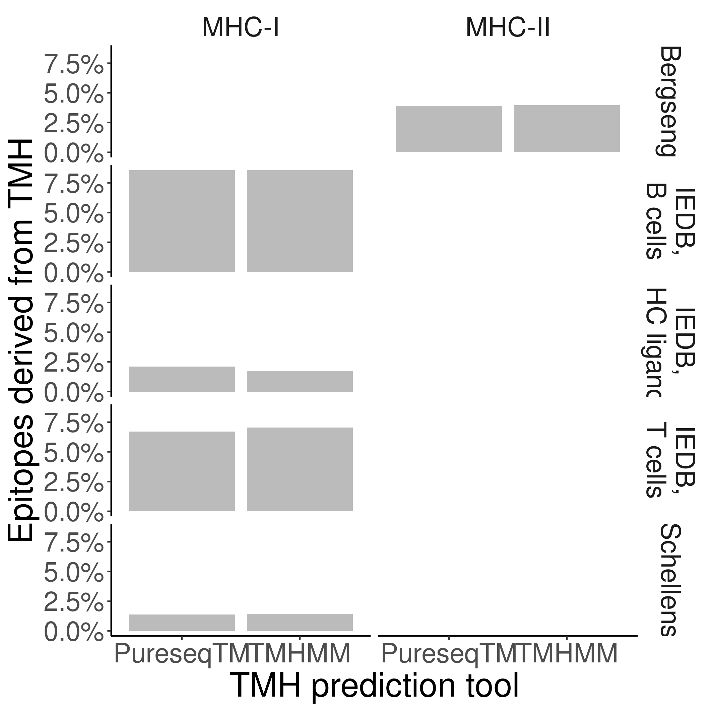

# bbbq_article_issue_157

Branch   |[](https://github.com/richelbilderbeek/bbbq_article_issue_157/actions)
---------|---------------------------------------------------------------------------------------------------------------------------
`master` |   
`develop`|  

BBBQ article Issue 157.



## Installation

From R, run:

```
remotes::install_github("richelbilderbeek/bianchi_et_al_2017")
remotes::install_github("richelbilderbeek/bbbq")
remotes::install_github("richelbilderbeek/pureseqtmr")
remotes::install_github("richelbilderbeek/tmhmm")
```

See [the tested GitHub Actions scripts](https://github.com/richelbilderbeek/bbbq_article_issue_157/blob/master/.github/workflows/R-CMD-check.yaml)
for more inspiration.

## Reproduce the results

From a terminal, do:

```
make
```

## Results

 * [results/results.csv](results/results.csv)
 * [results/tmhs_pureseqtm.csv](results/tmhs_pureseqtm_1.csv)
 * [results/tmhs_tmhmm.csv](results/tmhs_tmhmm_1.csv)
 * [results/tmhs_pureseqtm.csv](results/tmhs_pureseqtm_2.csv)
 * [results/tmhs_tmhmm.csv](results/tmhs_tmhmm_2.csv)


